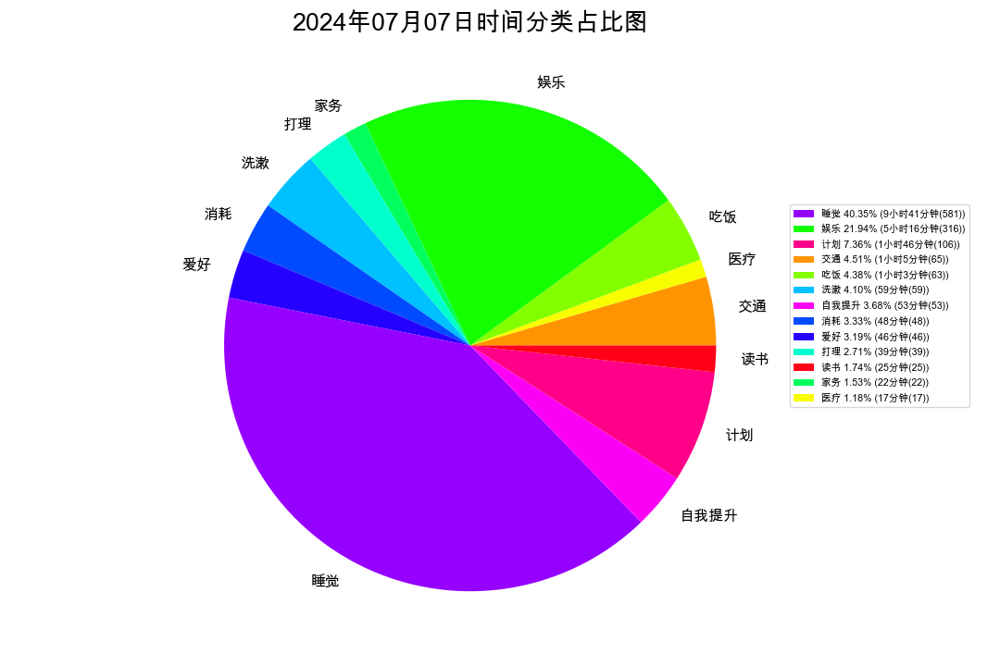
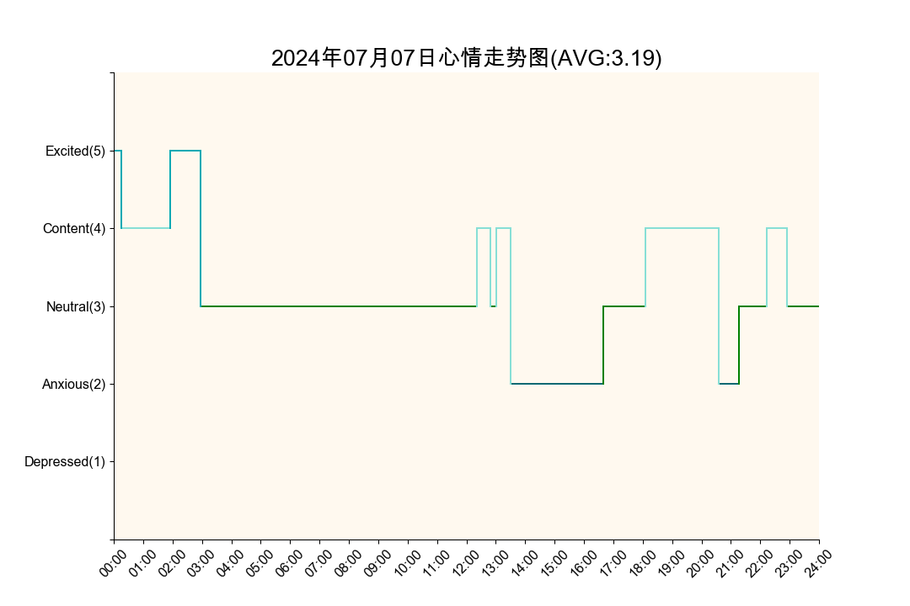
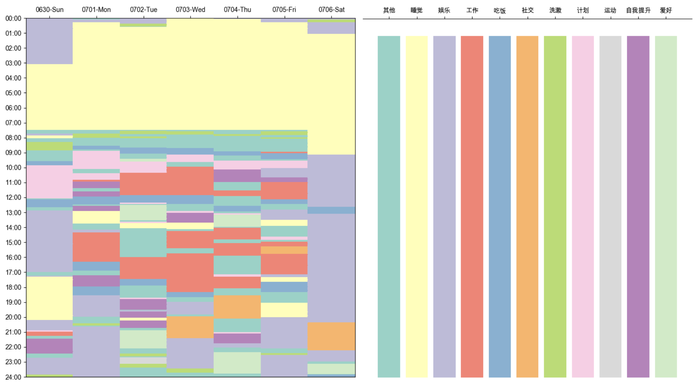
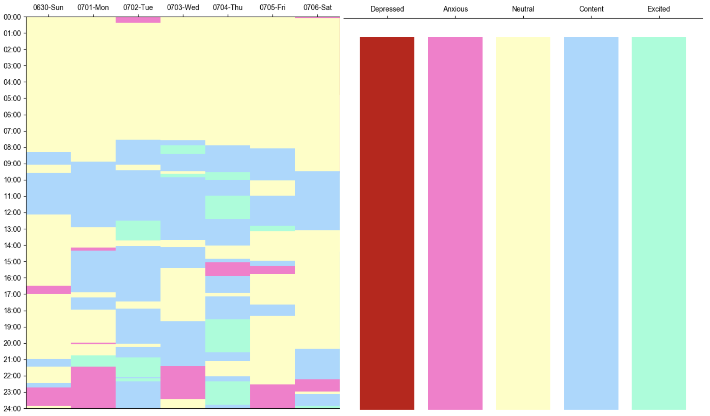
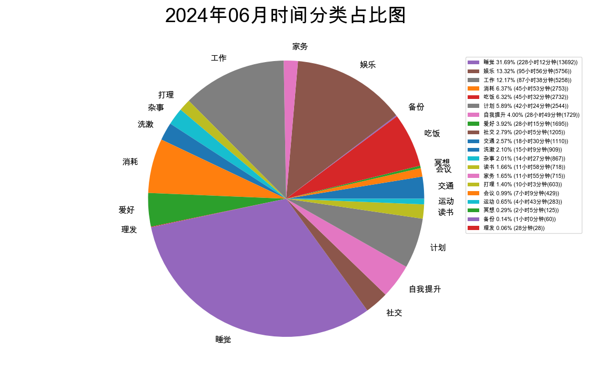
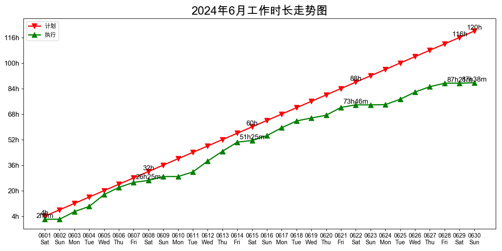

## 个人简介

          

### I'm Guanhui Qiao(乔冠辉)

- 👶97年, born in 河南
- 🏫中科院自动化所计算机专业博三在读, 武汉实习ing
- ❤️ notion四年忠实用户
- ⭐柳比歇夫时间记录统计法当代实践者
- 🎮炉石传说7年玩家(无视版本任务贼);王者荣耀酷爱孙策;PVZ砸罐子发烧友
- 🏅堕拉攻忠实挑战者(健身环大冒险)
- 📓新手剧本杀玩家(《孙策》;《天地藏春》)
- 🌍热爱阳明心学, 一生所求，此心光明

## 📈 数据是不会说谎的
### 日时间统计(2024.07.07)

### 周时间统计(2024.06.30-2024.07.06)

### 月时间统计(2024.06.01-2024.06.30)

## 联系我

|平台|账户名|
|-----|------------------|
|邮箱|18811076159@163.com|
|微信|doctor0324|

## 其他信息
[学术主页(未完工)](https://qiaogh97.github.io)
[Google Scholar](https://scholar.google.com/citations?hl=zh-CN&user=FqQG_L4AAAAJ)

## 个性签名
> 承阳明之心学，明圣贤之大道
