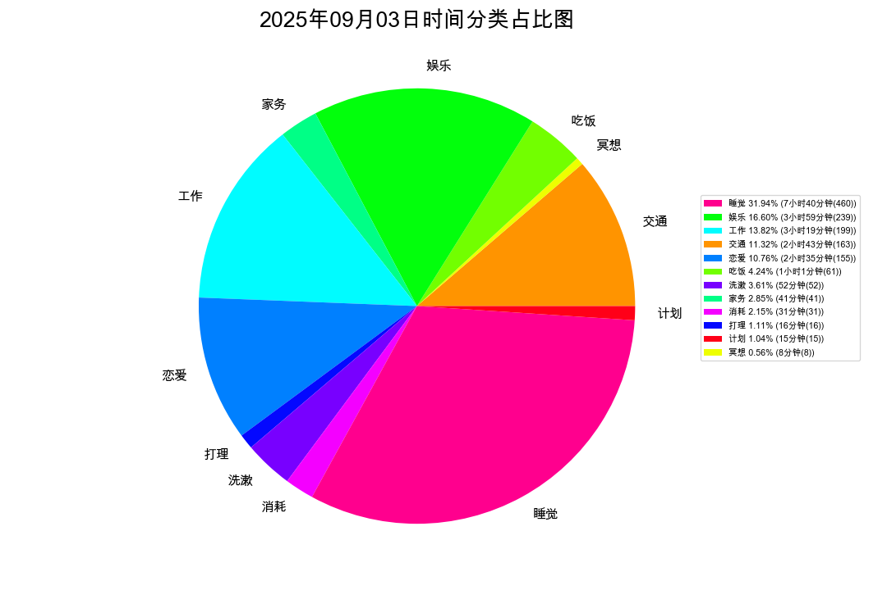
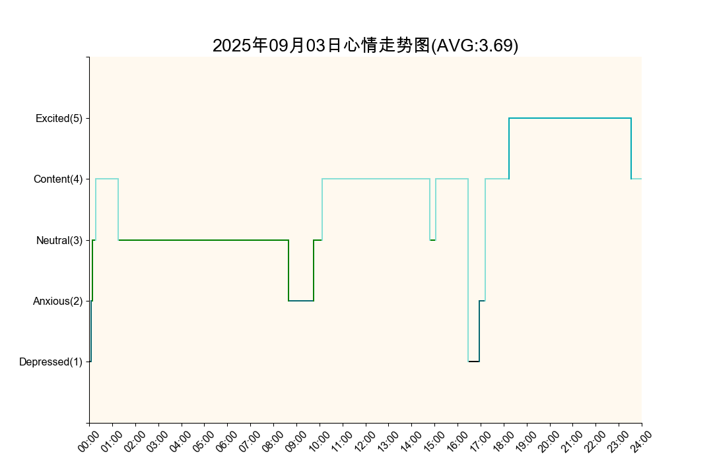
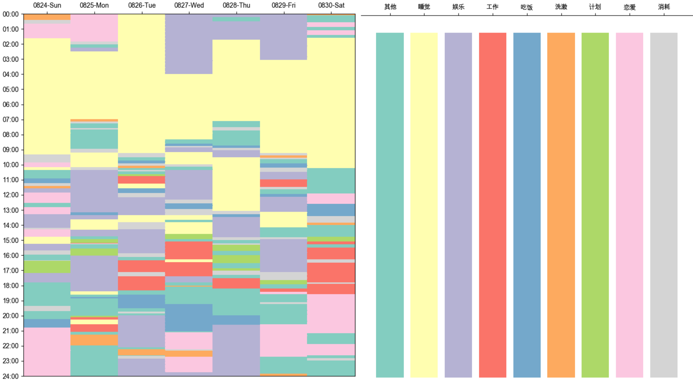
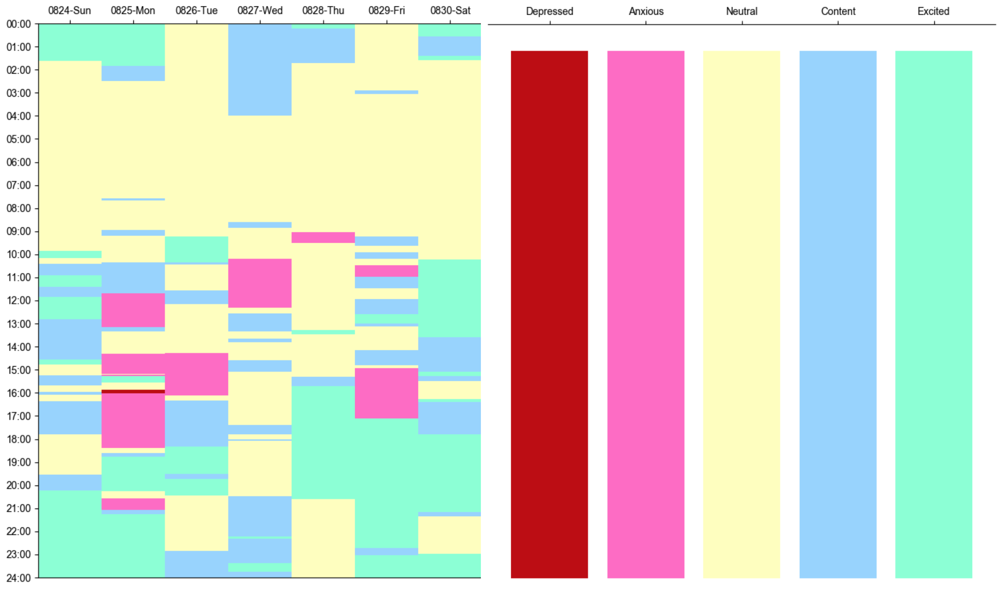
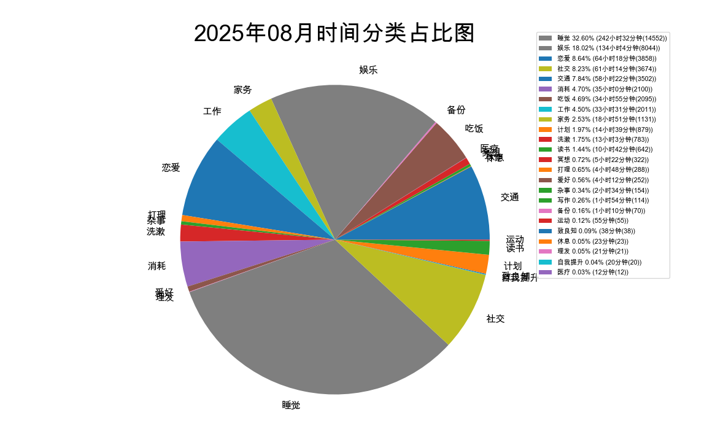
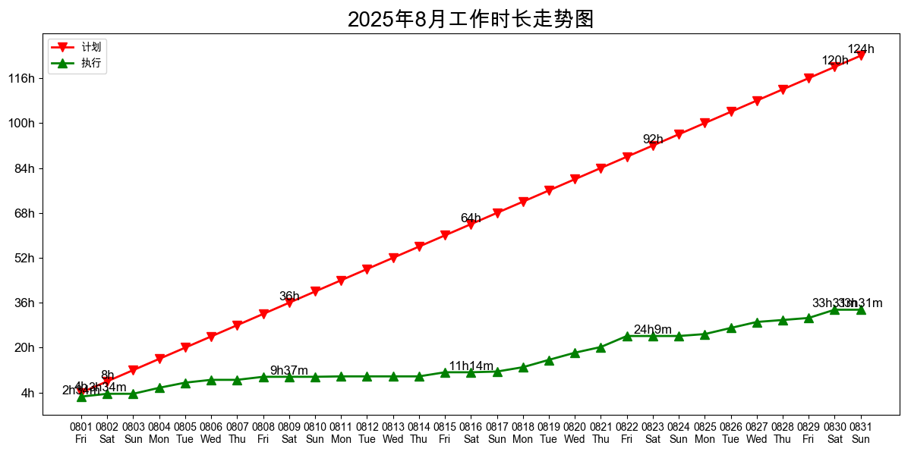

## 个人简介

          

### I'm Guanhui Qiao(乔冠辉)

- 👶97年, born in 河南
- 🏫中科院自动化所计算机专业博四在读, 预计26年毕业，base武汉
- ❤️ notion四年忠实用户
- ⭐柳比歇夫时间记录统计法当代实践者
- 🎮王者荣耀酷爱孙策;PVZ砸罐子发烧友
- 🏅堕拉攻忠实挑战者(健身环大冒险)
- 🌍心如明镜,物来则照;万物一体,吾性具足;任它千变万化,我心自岿然不动;浩浩乎照见世间万物而不失其本体,荡荡乎如庖丁解牛游刃有余

## 📈 数据是不会说谎的
### 日时间统计(2025.09.03)

### 周时间统计(2025.08.24-2025.08.30)

### 月时间统计(2025.08.01-2025.08.31)

## 联系我

|平台|账户名|
|-----|------------------|
|邮箱|18811076159@163.com|
|微信|doctor0324|

## 其他信息
[学术主页](https://qiaogh97.github.io)
[Google Scholar](https://scholar.google.com/citations?hl=zh-CN&user=FqQG_L4AAAAJ)

## 个性签名
> 承阳明之心学，明圣贤之大道
